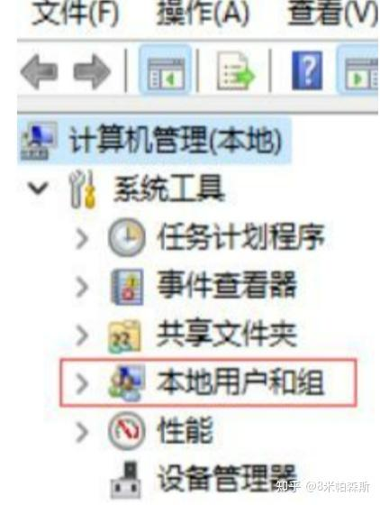
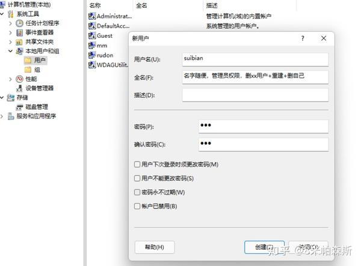
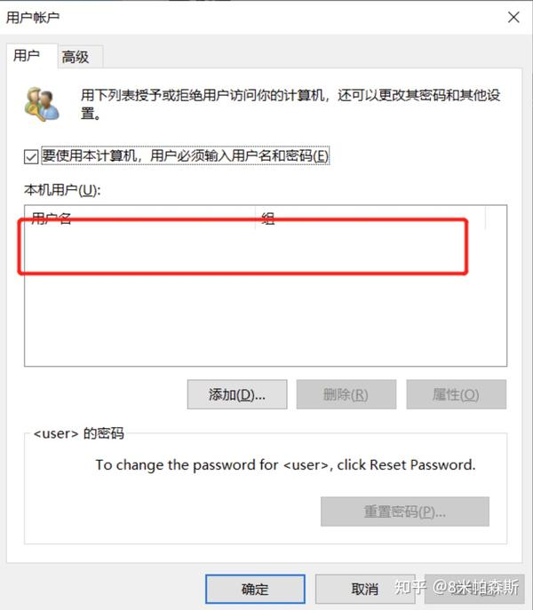
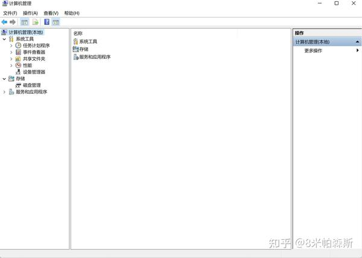
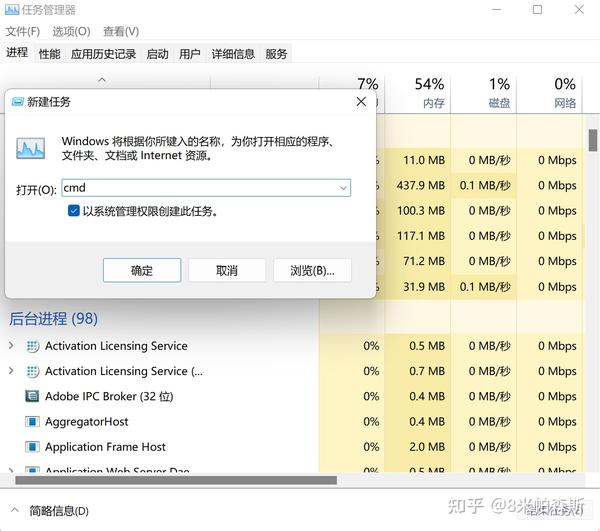
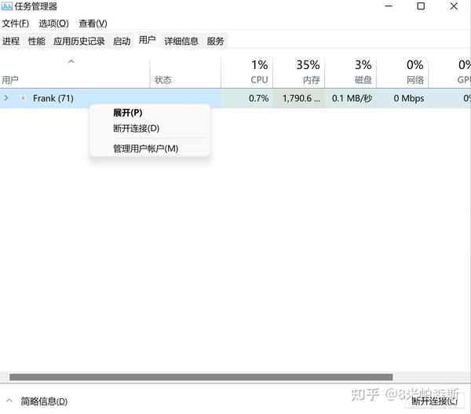

# 关于Win11修改User名字的避坑点
导语：最近跑很多项目的时候，发现C盘中的中文用户名会引起许多奇怪的抱错，导致项目无法正常运行，所以就想修改中文用户名，在一番努力后，成功差点把电脑搞坏了，于是想要写一篇文章来避坑。
## 1.一些可能可以的方式 ##
网络上许多博主修改Windows用户名字时，一般都是两种方式：

(1)都会先叫你用**Win+R**打开运行窗口，然后输入：**netplwiz**，打开netplwiz界面，然后修改用户名，修改注册表什么的，繁琐且电脑不能正常使用的风险高。

具体可以看下面的文章:

https://www.bilibili.com/read/cv29781750/?jump_opus=1

**注意事项：**

**这种方法较为繁琐，且存在较高的风险。如果操作不当，可能会导致用户账户丢失，无法打开设置和资源管理器等功能。因此，不建议轻易尝试。**

(2)或者是，右键点击"计算机"图标:


选择更多选项


选择"管理"


选择"本地用户和组"



点开后会有用户文件夹,直接改就好了



**注意事项：**

**这种方法在某些系统中可能找不到"本地用户和组"选项，且修改后可能需要重启计算机才能生效。不排除失败或无法修改的可能性。**

亲身经历：




都无法成功修改

## 2.最稳妥的方式 ##
**在开始这个方法前，请确认Bitlocker是否关闭，并提前将存在用户文件夹中的重要文件备份一下**

具体可以看下面这篇文章：

https://zhuanlan.zhihu.com/p/60704389

右键这个 "开始" 图标


选择任务管理器


在任务管理器中，选择文件，运行新的任务，并以系统管理权限运行cmd



运行cmd后，输入以下代码来创建新的用户：

``` net user 用户名 新密码 /add ```

如果想要删除不用的用户，可以使用以下代码来实现：

``` net user 用户名 新密码 /delete ```

设置完之后，就可以在任务管理器中选择用户，再选择断开连接。



之后重新登陆新创建的账号就好了

---
**这样修改完之后，可能有些软件无法使用，需要重新安装一下，虽然有点麻烦，但风险很低。
可以正常使用之后，之前中文名的用户就可以删除了**
