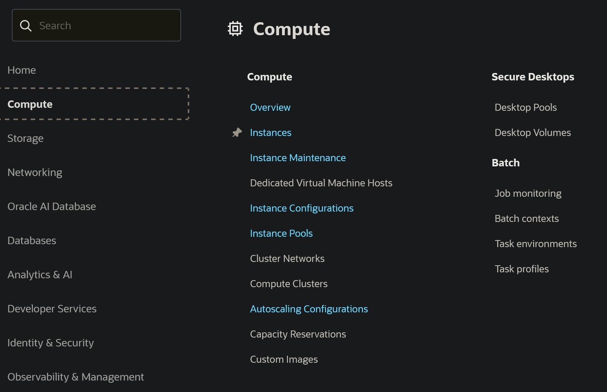
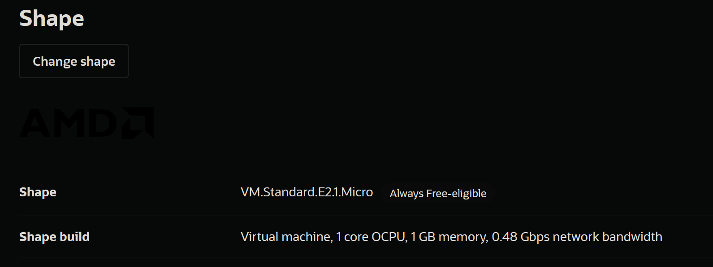
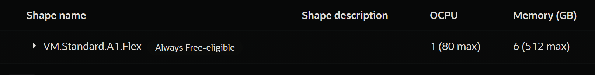

## 写在前面
此文为记录整个Oracle cloud自建节点的过程，其中会包括一些避坑点和具体步骤，感觉应该挺有意义的吧，希望对于同为小白的网友，有帮助。

## 步骤一：撬开龟壳
自建前肯定都先有Oracle cloud的账号，这一步就没有什么好说的，比较玄学，大多数情况下都是ABC失败。

展示一下倘若注册成功的图片：


然后需要准备的东西：
1. 一张MasterCard或者是visa卡，用于绑卡验证的
2. 无痕模式的浏览器
3. AI给你的地址，尽量填真实的地址，用拼音都没有关系，总之听AI的。

我当时就是使用公司的WLAN，无痕edge，然后关闭梯子，使用自己之前出国前办的MasterCard卡，地址发给AI，让它转换，最好说一下我在注册Oracle cloud，可能效果会更好一些。然后我当时卡里是有余额的，所以不清楚是不是会有影响。

## 步骤二：创建实例

这个其实都可以问AI，总之我大致展示一下，点击左上角，然后点击instances

然后我们就可以创建实例了

比较重要的是这个Shape


对于free-tier的账号目前就只能选额这两种配置的云服务器



就是后面有写Always Free-eligible的，剩下的配置什么的还是得问AI，怎么搞。

对于配置稍好的服务器比较难抢到，大部分情况下都是out of capacity, 所以也可以选择付费升级。

## 步骤三：保存ssh密钥
然后在创建过程中，应该会有两个ssh密钥需要你保存，**需要保管好**，因为日后可以通过以下命令来访问你的Oracle实例，具体可以问AI，我是oracle linux的image，所以启动命令为
```bash
ssh -i "密钥文件" opc@public ip

```

## 步骤四：根据协议选择合适的脚本
GitHub上有很多一键安装的脚本，还是很方便的，关于wireguard我试过了，基本没法用，所以还是选择一键脚本吧。我用的是这个项目：https://github.com/eooce/Sing-box

启动云服务后，运行以下命令就好了
```bash
bash <(curl -Ls https://raw.githubusercontent.com/eooce/sing-box/main/sing-box.sh)

```
运行完可能会遇到各种问题，看看我让AI总结的：
---

#### 一、速度瓶颈定位：WireGuard 为何只有 100KB/s？

**问题现象**：WireGuard 隧道内测速极低，最高仅 100KB/s。

**排查过程**：
1. `lscpu` 确认实例规格为 AMD EPYC 7742 2 核，属于标准的 E2.1.Micro 免费实例，基础带宽天花板在 50Mbps 左右。
2. 在 VPS 本机执行 `curl` 拉取阿里云和清华源，速度分别达到 **6.6 MB/s** 和 **3.9 MB/s**，证明 **VPS 本机出口带宽完全正常**。
3. 排除实例带宽不足后，判断问题出在“中国大陆 → VPS”这一段的协议特征上。

**根本原因**：甲骨文云对来自中国大陆的 UDP 流量存在**定向 QoS 压制**。它不是简单限速，而是通过**随机丢包 + 虚假 RTT 突变**来破坏标准拥塞控制算法（如 CUBIC/BBR）。WireGuard 基于 UDP 且无混淆层，流量特征明显，被精准识别并压制。

**解决方案**：放弃 WireGuard，改用 **Hysteria2**。它基于 QUIC（UDP），但使用 **Brutal 拥塞控制算法**，不依赖丢包/RTT 反馈，配合前向纠错（FEC），能硬抗这种噪声注入。

---

#### 二、系统环境踩坑：Oracle Linux 与 SELinux

**问题现象**：一键脚本安装完成后，`sing-box` 服务反复崩溃，状态为 `activating (auto-restart)`。

**排查过程**：
1. 执行 `journalctl -u sing-box --no-pager | grep "FATAL"` 查看日志。
2. 日志显示：`initialize rule-set: Get "https://raw.githubusercontent.com/..." (dial tcp ... connect: permission denied)`。
3. 执行 `sudo sestatus`，发现 `Current mode: enforcing`，**SELinux 正在强制拦截**。

**根本原因**：Oracle Linux 默认启用 SELinux 的 enforcing 模式。sing-box 在启动时需要从 GitHub 下载分流规则集（`rule-set`），但 SELinux 拦截了它的出站网络请求，导致进程直接崩溃。

**解决方案**：
1. **临时验证**：`sudo setenforce 0`，服务立刻变为 `active (running)`。
2. **永久生效**：修改 `/etc/selinux/config`，将 `SELINUX=enforcing` 改为 `SELINUX=disabled`，然后重启 VPS。

---

#### 三、客户端订阅踩坑：格式不匹配与手动配置

**问题现象**：Clash Verge 导入订阅时提示 `proxy group[0]: 'use' or 'proxies' missing`。

**排查过程**：
1. sing-box 脚本生成的是 **sing-box 专用格式**订阅，与 Clash 的 YAML 格式不兼容。
2. 尝试使用在线订阅转换工具，但因填错原始链接（填成了转换后的链接）而失败。

**解决方案**：放弃在线转换，**手动编写本地 `oracle.yaml`** 文件，将节点信息逐一填入。

**关键坑点**：脚本端口会动态变化，且 Reality 的 **公钥（pbk）** 极其敏感，抄错一个字符都会导致 VLESS 超时。

---

#### 四、网络连通性踩坑：防火墙与安全列表

**问题现象**：客户端全部节点 timeout。

**排查过程**：
1. `sudo ss -tulnp | grep sing-box` 发现实际监听端口是 `22426-22429`，而非脚本最初显示的 `22424-22428`。
2. 在本地电脑用 `Test-NetConnection 140.245.106.154 -Port 22426` 测试，返回 `TcpTestSucceeded : True`，说明 TCP 链路是通的。

**根本原因**：
1. **Oracle 云安全列表**：仅放行了 `22427`，未放行新的端口范围。
2. **VPS 本机防火墙**：`firewalld` 放行了旧端口，新端口未放行。

**解决方案**：
1. 在 Oracle 控制台的安全列表里，将 TCP 和 UDP 的目标端口范围都改为 `22426-22429`。
2. 在 VPS 上执行 `firewall-cmd --add-port=22426-22429/tcp --permanent` 和 `--add-port=22426-22429/udp --permanent`，然后 `firewall-cmd --reload`。

---

#### 五、Hysteria2 速度优化：激活 Brutal 模式

**问题现象**：Hysteria2 虽然能连上，但速度依然不理想。

**原因分析**：Hysteria2 默认没有强制启用 Brutal 拥塞控制，或者本地网络对 UDP 单端口有 QoS 限速。

**解决方案**：
1. 在 Clash Verge 的配置文件中，为 Hysteria2 节点显式声明带宽：

    ```yaml
    up: "50 Mbps"
    down: "100 Mbps"
    ```

    这会激活服务端的 Brutal 算法，使其开始“硬发”数据包。

2. 如果速度仍不理想，可以尝试 **端口跳跃（Port Hopping）**，在 `22426-22429` 范围内随机跳变，对抗 UDP 单端口限速。

---

#### 六、最终方案与经验总结

**最终配置**：
- **主力节点**：Hysteria2（UDP 22429），配合 `up/down` 带宽参数激活 Brutal 模式。
- **保底节点**：VLESS-Reality（TCP 22426），用于 Hysteria2 被完全阻断时的备用通道。
- **系统环境**：Oracle Linux + sing-box，SELinux 永久禁用。

**给后来者的建议**：
1. **甲骨文免费实例不要用 WireGuard**：UDP 特征太明显，容易被 QoS 精准打击。
2. **优先选择 Hysteria2**：它的 Brutal 算法是目前对抗甲骨文 QoS 最有效的方案。
3. **SELinux 是隐形杀手**：Oracle Linux 默认开启，会拦截服务的出站网络请求，建议直接禁用。
4. **注意端口变化**：一键脚本分配的端口可能动态变化，放行前务必用 `ss -tulnp` 确认实际监听端口。
5. **保护好订阅链接**：避免公开分享，防止被滥用导致封号。
6. **保持备份心态**：甲骨文免费号随时可能被收回，重要数据务必做好备份。


## 步骤五：新建yaml文件
因为我用的是clash verge，所以用的是适配clash的yaml文件，总之，有什么问题也是可以问AI。
如果一切顺利的话，你就已经可以用了，爽用自建节点吧