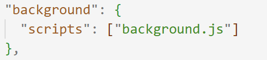
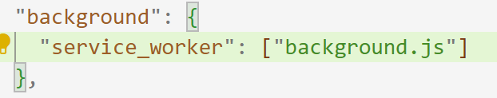
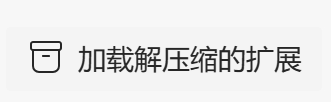

# 关于浏览器拓展插件开发的那些事
**写在前面**

如果使用原生的web开发 (html,css,js)
## 首先是必须的文件列表：
1. manifest.json
2. background.js
3. popup.html (类似于index.html,就是浏览器拓展的主界面)
4. popup.js（国际化啊，
5. popup.css (样式文件)

对于火狐浏览器：在manifest.json文件中现需要写成这样：

对于谷歌浏览器：在manifest.json文件中现需要写成这样：

## 加载文件目录

**chrome浏览器**

chrome://extensions/

**edge浏览器**

edge://extensions/

